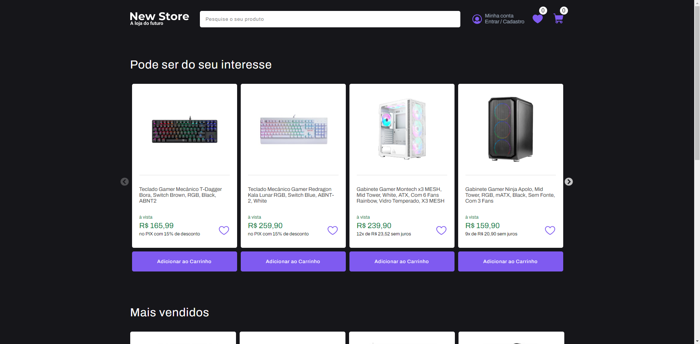

<h1 align="center">
 🛒 New Store
</h1>

<h4 align="center"><a href="https://newstore-phi.vercel.app/">Clique aqui para visitar o projeto</a></h4>
 

<h3>Introdução 🙂</h3>

Este é um projeto de um e-commerce básico criado para fins de treinamento. Ele consiste em uma página para exibir os produtos, um carrinho de compras e uma lista de favoritos.

 

<h3>Páginas 📖</h3>

O site é composto por três páginas principais:

<strong>Página Principal:</strong> A página principal apresenta duas seções. A primeira seção exibe um carrossel de produtos em destaque, enquanto a segunda seção mostra os demais produtos.

<strong>Página de Carrinho:</strong> A página de carrinho exibe os produtos adicionados pelo usuário, permitindo que eles visualizem e ajustem a quantidade de itens no carrinho.

<strong>Página de Favoritos:</strong> A página de favoritos mostra os produtos marcados como favoritos pelo usuário, permitindo que mantenham uma lista de produtos para futuras compras.

 

<h3>Responsividade 📱</h3>

O site é totalmente responsivo, adaptando-se automaticamente em diferentes tamanhos de tela, proporcionando a mesma experiência em celulares, tablets e desktops.

 

<h3>Tecnlogias Utilizadas 💻</h3>

O projeto utiliza as seguintes tecnologias:

<strong>React</strong>

<strong>React-slick</strong>

<strong>Styled-components</strong>

<strong>Sweetalert2</strong>

<strong>React-router</strong>

 
